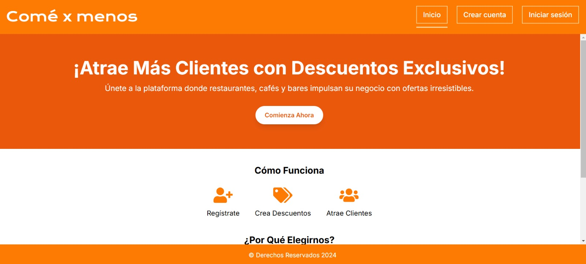
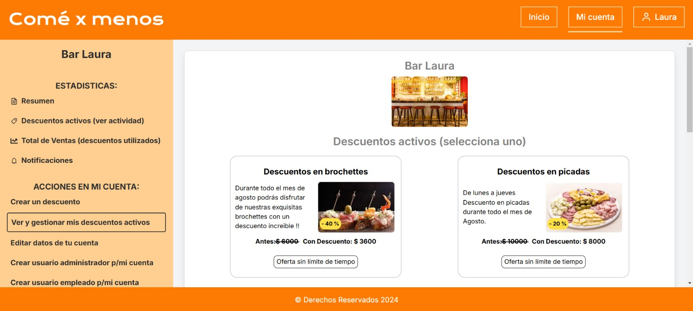
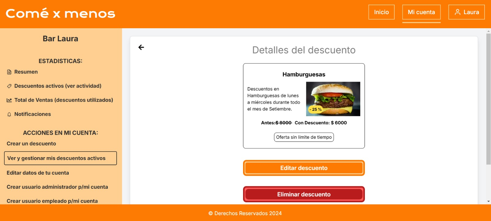

<!-- This is a [Next.js](https://nextjs.org/) project bootstrapped with [`create-next-app`](https://github.com/vercel/next.js/tree/canary/packages/create-next-app).

## Getting Started

First, run the development server:

```bash
npm run dev
# or
yarn dev
# or
pnpm dev
# or
bun dev
```

Open [http://localhost:3000](http://localhost:3000) with your browser to see the result.

You can start editing the page by modifying `app/page.tsx`. The page auto-updates as you edit the file.

This project uses [`next/font`](https://nextjs.org/docs/basic-features/font-optimization) to automatically optimize and load Inter, a custom Google Font.

## Learn More

To learn more about Next.js, take a look at the following resources:

- [Next.js Documentation](https://nextjs.org/docs) - learn about Next.js features and API.
- [Learn Next.js](https://nextjs.org/learn) - an interactive Next.js tutorial.

You can check out [the Next.js GitHub repository](https://github.com/vercel/next.js/) - your feedback and contributions are welcome!

## Deploy on Vercel

The easiest way to deploy your Next.js app is to use the [Vercel Platform](https://vercel.com/new?utm_medium=default-template&filter=next.js&utm_source=create-next-app&utm_campaign=create-next-app-readme) from the creators of Next.js.

Check out our [Next.js deployment documentation](https://nextjs.org/docs/deployment) for more details. -->


# Comé x Menos
Aplicación para encontrar descuentos negocios de comidas (en restaurantes, cafeterías, panaderías y más). Diseñada para conectar negocios con clientes de manera eficiente y dinámica.

Este proyecto permite a los usuarios finales encontrar descuentos en tiempo real, mientras que los dueños de negocios pueden gestionar sus ofertas de manera sencilla. La aplicación cuenta con autenticación de usuarios, temporizador para descuentos activos, y una interfaz moderna creada con Next.js.

## Capturas de pantalla
<div style="margin-bottom: 20px;">
  
</div>

<div style="margin-bottom: 20px;">
  
</div>

<div style="margin-bottom: 20px;">
  
</div>

## Tecnologías utilizadas
- Next.js
- React
- Node.js + Express
- MongoDB Atlas
- Firebase Authentication
- Tailwind CSS
- Vercel (Hosting)

## Instalación
1. Clona este repositorio:
   ```bash
   git clone https://github.com/OLuciani/discount-project-web.git
